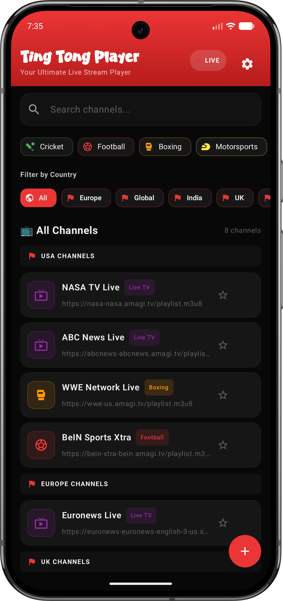

  

  <h1>Ting Tong Player</h1>

  

    <strong>A safe, private, ad-free Android media player for personal M3U and M3U8 streaming links.</strong>
  

  

    
    
    
  

  

    <a href="https://takiff507.github.io/ting-tong-player/"><strong>Open Website</strong></a>
    &nbsp;|&nbsp;
    <a href="https://github.com/takiff507/ting-tong-player/releases/latest/download/ting_tong_player_safe.apk"><strong>Download APK</strong></a>
    &nbsp;|&nbsp;
    <a href="https://github.com/takiff507/ting-tong-player/releases"><strong>Releases</strong></a>
  

---

## Premium Player Experience

Ting Tong Player is built for people who want a clean Android player experience without noisy ads, hidden tracking, or complicated setup. It works as a personal media player and web browser utility for links that the user adds or chooses to play.

- Ad-free viewing experience with built-in web cleanup
- M3U and M3U8 playlist support
- Picture-in-picture playback for multitasking
- Local favorites, recent streams, and imported channels
- Optional HTTP proxy routing for media requests
- Simple backup and restore for custom streams

## Safe App Promise

This project is presented as the official safe app build for Ting Tong Player. The APK is intended to be clean, private, and transparent for users.

- No analytics SDK
- No personal account login
- No hidden telemetry
- No selling or sharing user data
- No PC paths, local machine details, or private developer information in public docs
- Official downloads are served from this repository and GitHub Pages

Security note: app safety should always be judged from the official APK and trusted scan results at release time. Avoid modified APK mirrors.

## Real Download Counter

The website shows a live download counter powered by GitHub Releases.

- Downloads are counted from GitHub release assets
- Counts survive website redeploys and future README updates
- The website can be pushed again without deleting download history
- Future APK releases can be counted together as total APK downloads

## Cumulative Website Visitors

The footer also shows a cumulative website visitor counter. It is a simple public page-load counter, not a live online-users counter.

- Yesterday's visits and today's visits add together
- Website redeploys do not reset the counter
- No local PC paths or private device information are published
- No personal user profile is shown on the website

## Privacy First

Ting Tong Player is designed so user data stays on the user's own device.

- Playlists and favorites are stored locally
- No browsing history is collected by this project
- No telemetry server is used by this website
- No private device or PC details are published here

## Legal Use

Ting Tong Player does not host, upload, index, or sell any video streams. It is a player utility. Users are responsible for only playing streams and playlists they have the right to access.

## Official Links

- Website: https://takiff507.github.io/ting-tong-player/
- APK: https://github.com/takiff507/ting-tong-player/releases/latest/download/ting_tong_player_safe.apk
- Releases: https://github.com/takiff507/ting-tong-player/releases
